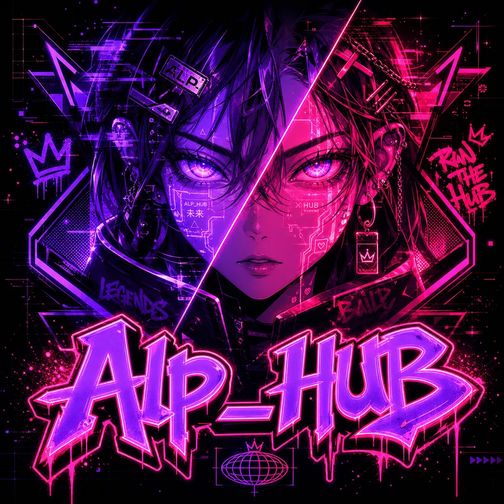
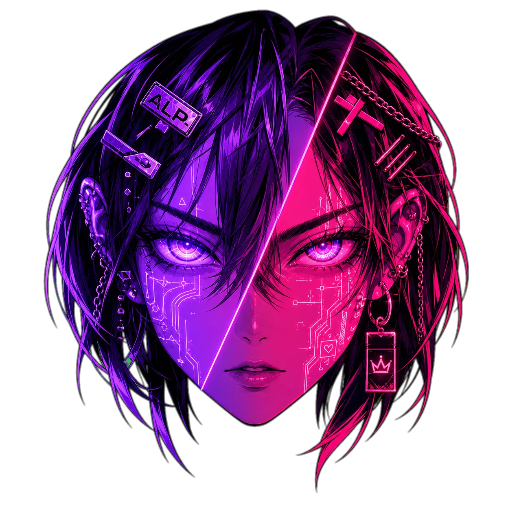

<a id="top"></a>

<div align="center">



# AlpHUB

**Personal audio processing desktop HUB — local, offline, GPU-accelerated**

[](https://github.com/minniesmick/AlpHUB/releases)
[](https://github.com/minniesmick/AlpHUB)
[](https://github.com/minniesmick/AlpHUB)
[](https://python.org)
[](https://nodejs.org)
[](https://developer.nvidia.com/cuda-toolkit)

<br/>



> AlpHUB is a dark-studio desktop app that puts three GPU-powered audio tools in one window — a node-based signal processor, a speech/voice pipeline, and a stem splitter — all running 100% locally with no cloud, no subscriptions, and no latency tax.

</div>

---

## Table of Contents

- [Overview](#overview)
- [Tools](#tools)
- [Screenshots](#screenshots)
- [Tech Stack](#tech-stack)
- [Prerequisites](#prerequisites)
- [Quick Start](#quick-start)
- [Model Setup](#model-setup)
- [Configuration](#configuration)
- [API Reference](#api-reference)
- [WebSocket Events](#websocket-events)
- [Development](#development)
- [Build & Package](#build--package)
- [Project Structure](#project-structure)
- [Roadmap](#roadmap)
- [Author](#author)

---

## Overview

AlpHUB is a personal-use Electron desktop app built around a FastAPI backend that manages a GPU job queue. All three tools share the same model directory, WebSocket event bus, and output folder — making it a unified audio workbench rather than three separate programs.

**Who it's for:** Audio engineers, music producers, researchers, and developers who want local GPU-accelerated audio processing without latency, cloud dependency, or subscription costs.

---

## Tools

### Signal Flow

Node-based ASIO audio graph editor powered by pedalboard (Spotify's VST3/audio effects library).

- Drag-and-drop node palette (Source → Effect → Sink)
- Effects: Equalizer, Compressor, Reverb, Delay, Gain
- Real-time ASIO stream with FFT spectrum visualization (10fps)
- Device manager for input/output selection, sample rate (44.1k–96k), and buffer size
- Preset browser — save/load full graph configurations
- Graph persisted to localStorage, synced to backend on every change

### Pipeline

Four speech/voice processing modes in one view:

| Mode | What it does |
|------|-------------|
| **STT** | Speech → Text via faster-whisper (tiny to large-v3) |
| **TTS** | Text → Speech via Kokoro (11 voices, American/British) |
| **STS** | Speech → Speech (whisper transcription → Kokoro re-synthesis) |
| **TTT** | Text → Text via local Ollama LLM |

- File drop or microphone input
- Waveform card for audio preview
- Typewriter card for text output
- Batch queue — drop multiple files, run in sequence
- RVC voice profile creation (voice cloning — stub, in progress)

### Stem Splitter

Source separation using Demucs — splits a mixed track into individual stems.

| Model | Stems |
|-------|-------|
| htdemucs_ft | vocals, drums, bass, other (best quality, fine-tuned) |
| htdemucs_6s | vocals, drums, bass, other, piano, guitar |
| htdemucs | vocals, drums, bass, other (standard) |
| mdx_extra | vocals, drums, bass, other (fast, strong separation) |

- Stem selection — choose which stems to export
- WAV or FLAC output
- StemGrid — listen and send individual stems to Pipeline with one click
- Drag-and-drop audio files or receive from Pipeline/Signal Flow via file transfer

---

## Screenshots

> Screenshots coming soon — run the app locally to see it in action.

---

## Tech Stack

| Layer | Technology |
|-------|-----------|
| Desktop shell | Electron 31 |
| Frontend | React 18, Vite 5, CSS Modules, electron-vite |
| Node graph | @xyflow/react 12 |
| Icons | Lucide React |
| Backend | FastAPI, Uvicorn, Python 3.11 |
| STT | faster-whisper (CTranslate2 CUDA) |
| TTS | Kokoro 0.9 + misaki[en] |
| Stem splitting | Demucs 4 (PyTorch CUDA) |
| Audio I/O | sounddevice (ASIO), soundfile |
| DSP / Effects | pedalboard (Spotify) |
| LLM | Ollama (local HTTP proxy) |
| Fonts | Inter Variable, JetBrains Mono Variable |

**Communication channels:**

| Channel | Use |
|---------|-----|
| REST `http://localhost:8765/api/*` | Control, model queries, job submission |
| WebSocket `ws://localhost:8765/ws` | Job progress, scan events, spectrum data |
| Electron IPC (`window.api`) | File reads, Ollama launch, OS shell ops |

---

## Prerequisites

| Requirement | Version | Notes |
|-------------|---------|-------|
| Node.js | 20+ | Frontend + Electron build |
| Python | 3.11 | pyenv-win recommended |
| pip | latest | Python package manager |
| CUDA toolkit | 12.1 | GPU inference (RTX recommended) |
| ASIO driver | any | ASIO4ALL or device-native (for Signal Flow) |
| Ollama | any | Optional — only needed for TTT mode |

> AlpHUB is Windows-primary. ASIO support is Windows-only. Pipeline and Splitter work anywhere Python + CUDA runs, but the app is not tested on macOS/Linux.

---

## Quick Start

### 1. Clone

```bash
git clone https://github.com/minniesmick/AlpHUB.git
cd AlpHUB
```

### 2. Install frontend dependencies

```bash
npm install
```

### 3. Set up Python venv

```bash
npm run setup-venv
```

Or manually:

```bash
# Install CUDA torch FIRST — pip will pull CPU-only torch if you skip this
pip install torch torchaudio --index-url https://download.pytorch.org/whl/cu121

# Then install the rest
pip install -r backend/requirements.txt
```

Venv path: `D:\AI_Ortak_Venv\hub_venv` (hardcoded in `package.json` backend script).

### 4. Place models (see [Model Setup](#model-setup))

### 5. Run

```bash
npm start
```

This starts both backend (FastAPI on `:8765`) and Electron (Vite HMR) via `concurrently`. The splash screen waits for the WS `scan_complete` event before navigating to the app.

---

## Model Setup

All models default to `D:\Ses_Modelleri`. Override any path in `backend/.env`.

### Directory layout

```
D:\Ses_Modelleri\
├── whisper\
│   └── models--Systran--faster-whisper-medium\     ← HF hub cache (auto-downloaded)
│       └── snapshots\<hash>\
│           └── model.bin
│
├── demucs\                                          ← set TORCH_HOME=D:\Ses_Modelleri\demucs
│   └── checkpoints\
│       ├── htdemucs_ft-...\.th
│       └── mdx_extra-...\.th
│
├── rvc\
│   ├── voices\*.pth                                ← drop .pth voice files here
│   └── profiles\<name>\meta.json                   ← cloned voice profiles
│
└── kokoro\
    └── models--hexgrad--Kokoro-82M\                ← HF hub cache (auto-downloaded)
        └── snapshots\<hash>\
            └── config.json
```

### Downloading models

**faster-whisper** — downloads automatically on first use, or pre-cache:
```bash
huggingface-cli download Systran/faster-whisper-medium --local-dir D:\Ses_Modelleri\whisper\models--Systran--faster-whisper-medium
```

**Demucs** — downloads automatically when a split job runs (reads `TORCH_HOME`):
```env
TORCH_HOME=D:\Ses_Modelleri\demucs
```

**Kokoro** — downloads automatically on first TTS job, or:
```bash
huggingface-cli download hexgrad/Kokoro-82M --local-dir "D:\Ses_Modelleri\kokoro\models--hexgrad--Kokoro-82M"
```

**RVC voice models** — drop `.pth` files directly into `D:\Ses_Modelleri\rvc\voices\`. App auto-discovers them on scan.

NTFS junctions work fine if models live on a separate drive.

---

## Configuration

### `backend/.env`

```env
# Model root — all tool subdirs are derived from this
MODEL_ROOT=D:\Ses_Modelleri

# Per-tool overrides (optional)
WHISPER_MODEL_DIR=D:\Ses_Modelleri\whisper
KOKORO_MODEL_DIR=D:\Ses_Modelleri\kokoro
RVC_VOICE_DIR=D:\Ses_Modelleri\rvc\voices
RVC_PROFILE_DIR=D:\Ses_Modelleri\rvc\profiles
TORCH_HOME=D:\Ses_Modelleri\demucs

# Output
DEFAULT_OUTPUT_DIR=D:\AlpHUB-Output

# Server
HOST=127.0.0.1
PORT=8765
```

Backend restart required after changing `.env`.

### In-app Settings

Settings persist to `localStorage`. Changing them takes effect immediately without restart.

| Setting | Default |
|---------|---------|
| Output path | `D:\AlpHUB-Output` |
| Models path | `D:\Ses_Modelleri` |
| RVC profiles path | `D:\Ses_Modelleri\rvc\profiles` |

Changing **Models path** in Settings triggers a fresh `GET /api/models?model_root=<path>` scan.

---

## API Reference

Full REST reference: `backend/API.md`  
Interactive docs (while backend running): `http://localhost:8765/docs`

### Endpoint summary

| Method | Path | Description |
|--------|------|-------------|
| GET | `/health` | Backend + WS client count |
| GET | `/api/system` | Python version, CUDA status, VRAM |
| GET | `/api/models` | Scan model dirs, return grouped list |
| POST | `/api/models/rescan` | Force re-scan with optional custom root |
| GET | `/api/daw/devices` | List ASIO input/output devices |
| POST | `/api/daw/start` | Open ASIO stream |
| POST | `/api/daw/stop` | Close ASIO stream |
| POST | `/api/daw/graph` | Rebuild pedalboard chain from node graph |
| PUT | `/api/daw/param` | Live-update single plugin parameter |
| POST | `/api/pipeline/run` | Queue STT/TTS/STS/TTT job |
| POST | `/api/splitter/run` | Queue Demucs stem split job |
| GET | `/api/ollama/status` | Check Ollama running on :11434 |
| GET | `/api/ollama/models` | List available Ollama models |

---

## WebSocket Events

All messages: `{ "type": string, "data": object }`  
Connection: `ws://localhost:8765/ws` — auto-reconnects every 2s.

### Backend → Frontend

| Event | Payload | When |
|-------|---------|------|
| `scan_progress` | `{ scanned, total, current_dir }` | Startup model scan (per tool dir) |
| `scan_complete` | `{ models: Record<tool, Model[]> }` | Startup scan finished |
| `job_queued` | `{ job_id, tool, name }` | Job added to GPU queue |
| `job_progress` | `{ job_id, progress, eta_seconds?, stage? }` | Progress update 0–100 |
| `job_complete` | `{ job_id, result_path }` | Job succeeded |
| `job_error` | `{ job_id, error }` | Job failed |
| `job_cancelled` | `{ job_id, tool, name }` | Job cancelled by user |
| `stream_status` | `{ active: bool }` | ASIO stream opened/closed |
| `spectrum_data` | `{ node_id, fft: number[128] }` | FFT spectrum at 10fps (stream active) |

---

## Development

### Port map

| Port | Service |
|------|---------|
| 8765 | FastAPI backend (REST + WS) |
| 5173 | Vite dev server (HMR) |
| 11434 | Ollama (external, optional) |

### Separate processes

```bash
npm run backend   # FastAPI only — auto-reloads on .py changes
npm run dev       # Electron + Vite HMR only
```

### Adding a backend route

1. Create `backend/routers/myfeature.py` with `router = APIRouter()`
2. Mount in `backend/main.py`: `app.include_router(myfeature.router, prefix="/api/myfeature")`
3. Add typed endpoint helper in `src/renderer/src/lib/api.ts`

### Frontend conventions

- CSS Modules — one `.module.css` per component
- Path alias `@renderer` → `src/renderer/src`
- Shared components in `src/renderer/src/components/`
- Brand colors: `#c77dff` (neon purple), `#f72585` (hot pink) — use CSS tokens from global stylesheet
- Fonts: Inter Variable (body), JetBrains Mono Variable (mono/data)
- TypeScript strict mode — no `any`, no untyped API calls

### TypeScript check

```bash
node node_modules/typescript/bin/tsc --noEmit --project tsconfig.web.json
```

---

## Build & Package

```bash
# NSIS installer (.exe)
npm run dist

# Portable .exe (no install required)
npm run dist:portable
```

Output: `dist/`

> The build runs `electron-vite build` first, then `electron-builder`. Python backend is **not** bundled — venv must be present at `D:\AI_Ortak_Venv\hub_venv` on the target machine.

---

## Project Structure

```
AlpHUB/
├── src/
│   ├── main/                       # Electron main process
│   │   └── index.ts                # App entry, BrowserWindow, IPC handlers
│   ├── preload/
│   │   └── index.ts                # contextBridge → window.api
│   └── renderer/
│       └── src/
│           ├── views/
│           │   ├── SplashScreen/   # Boot screen, WS connect, model scan progress
│           │   ├── SignalFlow/     # Node graph + ASIO transport bar
│           │   │   └── components/
│           │   │       ├── FlowCanvas/
│           │   │       ├── NodePalette/
│           │   │       ├── NodeInspector/
│           │   │       ├── TransportBar/
│           │   │       ├── DeviceManager/
│           │   │       └── PresetBrowser/
│           │   ├── Pipeline/       # STT / TTS / STS / TTT
│           │   │   └── components/
│           │   │       ├── ModeSelector/
│           │   │       ├── WaveformCard/
│           │   │       ├── TypewriterCard/
│           │   │       ├── OutputFileList/
│           │   │       └── ProfileCreationSheet/
│           │   └── Splitter/       # Stem separation
│           │       └── components/
│           │           └── StemGrid/
│           ├── components/         # Shared UI components
│           │   ├── AppShell/       # Navigation, layout root
│           │   ├── DeviceSelect/   # Custom ASIO device dropdown
│           │   ├── FileDropZone/   # Drag-and-drop audio input
│           │   ├── ModelSelector/  # Model picker dropdown
│           │   ├── ParameterSlider/
│           │   └── ProgressBar/
│           ├── context/
│           │   ├── Settings.tsx    # App settings (localStorage)
│           │   ├── Toast.tsx       # Toast notification system
│           │   └── FileTransfer.tsx # Cross-tool file passing
│           └── lib/
│               ├── api.ts          # Typed REST endpoint helpers
│               └── ws.ts           # WebSocket manager + typed event map
│
├── backend/
│   ├── main.py                     # FastAPI app, WS manager, startup scan
│   ├── requirements.txt
│   ├── .env                        # Paths config (not committed)
│   ├── API.md                      # Full REST + WS reference
│   ├── routers/
│   │   ├── models.py               # Model scan endpoints
│   │   ├── daw.py                  # ASIO stream + graph endpoints
│   │   ├── pipeline.py             # STT/TTS/STS/TTT job runner
│   │   ├── splitter.py             # Demucs stem split job runner
│   │   ├── ollama.py               # Ollama proxy
│   │   └── utils.py                # File read, misc
│   └── services/
│       ├── job_queue.py            # Async GPU-serialized job queue
│       └── model_scanner.py        # Whisper / Demucs / RVC / Kokoro discovery
│
├── build/
│   └── icon.png                    # electron-builder app icon
├── logo.png                        # Brand logo (full)
├── alp_hub_icon.png                # Brand icon (compact)
├── .design/alphub/                 # Design briefs, tokens, task lists
└── package.json
```

---

## Roadmap

- [ ] RVC voice cloning — full pipeline (currently stubbed)
- [ ] Signal Flow: MIDI controller input for live parameter automation
- [ ] Pipeline: batch file queue with parallel progress tracking
- [ ] Splitter: waveform preview per stem before export
- [ ] Ollama model pull / delete UI inside app
- [ ] Plugin system for custom Signal Flow node types
- [ ] Spectrum analyzer node in Signal Flow canvas
- [ ] Export / import Signal Flow presets as shareable JSON
- [ ] Settings: configurable venv path (remove hardcoded `D:\AI_Ortak_Venv`)
- [ ] Portable build with bundled Python backend

---

## Author

**Alper Yusuf Yaman**  
[@minniesmick](https://github.com/minniesmick) on GitHub

---

<div align="center">
  
  <br/>
  <sub>Built local-first. No cloud. No telemetry. Your GPU, your audio.</sub>
  <br/><br/>
  <a href="#top">↑ back to top</a>
</div>
